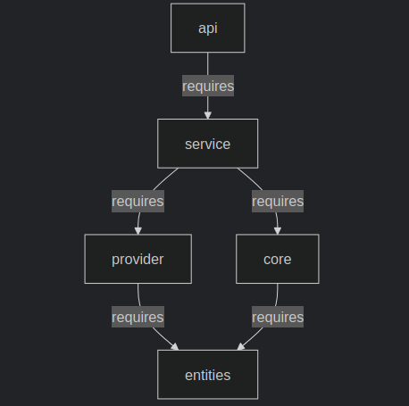

# Shrek Realm Expander

Приложение демонстрирует современный подход к организации 
многомодульного проекта с использованием Java Platform Module System (JPMS).

Логика приложения - управление персонажами вселенной Шрека с проверкой на "сказочность"

### Технологии

    Java 17
    Java Platform Module System (JPMS)
    Spring Boot 3.x
    Lombok
    MapStruct (для маппинга DTO)
    JUnit 5 + Mockito (тесты)

## Модули

| Модуль       | Назначение                                            |
|--------------|-------------------------------------------------------|
| **api**      | Запуск приложения + REST контроллеры                  |
| **service**  | Бизнес-логика (регистрация, фильтрация персонажей)    |
| **provider** | Данные о сказочных персонажах (из внешних источников) |
| **core**     | Хранилище персонажей Шрека                            |
| **entities** | Общие DTO (`CommonEnchantedCharacter`)                |

## API Endpoints

```http
POST /api/users/register?name={name}
```
Регистрирует нового персонажа (только если он сказочный)

```http
GET /api/shrekCharacters
```
Возвращает всех персонажей вселенной Шрека

```http
GET /api/enchantedCharacters
```
Возвращает всех сказочных персонажей

## Архитектура

### Структура пакетов
Каждый модуль имеет следующую структуру пакетов (на примере core):

```text
src/
├── main/
│   ├── java/
│   │   └── edu.janeforjane.core/
│   │       ├── api/            ← Интерфейсы сервисов + исключения
│   │       ├── config/         ← Конфигурация бинов
│   │       └── internal/       ← Реализации 
│   └── resources/              ← shrek-characters.json
```

### Взаимодействие модулей



## Типовой flow (пример)

    Запрос: POST /register?name=Mulan
    ↓
    provider проверяет, что Mulan - сказочный персонаж
    ↓
    service генерирует магический ID (ope-1014nse-917sa-216me)
    ↓
    service назначает роль во вселенной Шрека ("Scenery")
    ↓
    core сохраняет обогащенные данные
    ↓
    в ответе возращаются полные данные нового персонажа Шрека

## Примеры данных

До обработки (из provider):

```json
{
  "id": null,
  "name": "Mulan",
  "shrekRole": null,
  "personalityTraits": null,
  "shrekStoryline": null,
  "group": "Human",
  "alignment": "Good",
  "originStory": "A tale of Mulan, the brave warrior.",
  "specialAbilities": [
    "Combat Skills",
    "Strategy"
  ]
}
```

После обработки (в core):

```json
{
  "id": "ope-1014nse-917sa-216me",
  "name": "Mulan",
  "shrekRole": "Scenery",
  "personalityTraits": "Brave, Optimistic",
  "shrekStoryline": "Cooks magic potions for all.",
  "group": "Human",
  "alignment": "Good",
  "originStory": "A tale of Mulan, the brave warrior.",
  "specialAbilities": [
    "Combat Skills",
    "Strategy"
  ]
}
```


## Запуск

### Запуск приложения

Собрать и запустить
```shell
mvn clean package
java -jar api/target/app.jar
```

Сразу запустить (уже собранный jar)
```shell
java -jar api/target/app.jar
```
### Примеры запросов

Запрос на создание получение всех возможных для добавления волшебных персонажей:
```shell
curl --request GET \
  --url http://localhost:8080/api/users/enchantedCharacters
```

Ответ:
```json
[
  {
    "id": null,
    "name": "Peter Pan",
    "shrekRole": null,
    "personalityTraits": null,
    "shrekStoryline": null,
    "group": "Human",
    "alignment": "Evil",
    "originStory": "A tale of Peter Pan in Neverland.",
    "specialAbilities": [
      "Flight",
      "Mischief"
    ]
  },
  {
    "id": null,
    "name": "Mulan",
    "shrekRole": null,
    "personalityTraits": null,
    "shrekStoryline": null,
    "group": "Human",
    "alignment": "Good",
    "originStory": "A tale of Mulan, the brave warrior.",
    "specialAbilities": [
      "Combat Skills",
      "Strategy"
    ]
  },
  {
    "id": null,
    "name": "Belle",
    "shrekRole": null,
    "personalityTraits": null,
    "shrekStoryline": null,
    "group": "Human",
    "alignment": "Good",
    "originStory": "A tale of Belle and the Beast.",
    "specialAbilities": [
      "Kindness",
      "Bravery"
    ]
  },
  {
    "id": null,
    "name": "Jasmine",
    "shrekRole": null,
    "personalityTraits": null,
    "shrekStoryline": null,
    "group": "Human",
    "alignment": "Good",
    "originStory": "A tale of Princess Jasmine in Agrabah.",
    "specialAbilities": [
      "Diplomacy",
      "Courage"
    ]
  }
]
```


Запрос на создание получение всех персонажей Шрека:

```shell
curl --request GET \
  --url http://localhost:8080/api/users/shrekCharacters
```

Ответ:
```json
[{
		"id": "Ala-345-ka-678-zam-901",
		"name": "Three Pigs",
		"shrekRole": "Supporting",
		"personalityTraits": "Independent, Brave",
		"shrekStoryline": "An adventure with Three Pigs in the world of Shrek.",
		"group": "animal",
		"alignment": "good",
		"originStory": "The Three Little Pigs are brothers who build houses to protect themselves from the Big Bad Wolf.",
		"specialAbilities": [
			"Expert builders",
			"Can outsmart the wolf with their clever plans"
		]
	},
	{
		"id": "Ala-678-ka-901-zam-234",
		"name": "Gingy",
		"shrekRole": "Main",
		"personalityTraits": "Kind-hearted, Grumpy",
		"shrekStoryline": "An adventure with Gingy in the world of Shrek.",
		"group": "creature",
		"alignment": "good",
		"originStory": "Gingy is a gingerbread man brought to life by a spell.",
		"specialAbilities": [
			"Can survive being eaten",
			"Has a sweet tooth for revenge"
		]
	},
	{
		"id": "Abr-234-cad-567-abr-890",
		"name": "Shrek",
		"shrekRole": "Main",
		"personalityTraits": "Grumpy, Kind-hearted",
		"shrekStoryline": "An adventure with Shrek in the world of Shrek.",
		"group": "creature",
		"alignment": "good",
		"originStory": "Shrek is an ogre who lives in a swamp and becomes an unlikely hero.",
		"specialAbilities": [
			"Can scare off intruders with his ogre roar",
			"Has a heart of gold"
		]
	},
	{
		"id": "Ope-567-n-890-Se-345",
		"name": "Puss",
		"shrekRole": "Supporting",
		"personalityTraits": "Brave, Grumpy",
		"shrekStoryline": "An adventure with Puss in the world of Shrek.",
		"group": "animal",
		"alignment": "good",
		"originStory": "Puss in Boots is a swashbuckling cat with a mysterious past.",
		"specialAbilities": [
			"Expert swordsmanship",
			"Can charm anyone with his big eyes"
		]
	}
]
```

Запрос на создание нового персонажа:

```shell
curl --request POST \
  --url 'http://localhost:8080/api/users/register?name=Mulan'
```

Ответ:
```text
Successfully!
★★★★★★★★★★★★★★★★★★★★★★★★★★★★★★★★★★★★★★★★★★
		name=Mulan
		shrekRole=Scenery
		personalityTraits=Brave, Optimistic
		shrekStoryline=Cooks magic potions for all.
		group=Human
		alignment=Good
		originStory=A tale of Mulan, the brave warrior.
		specialAbilities=[Combat Skills, Strategy]
★★★★★★★★★★★★★★★★★★★★★★★★★★★★★★★★★★★★★★★★★★
```
