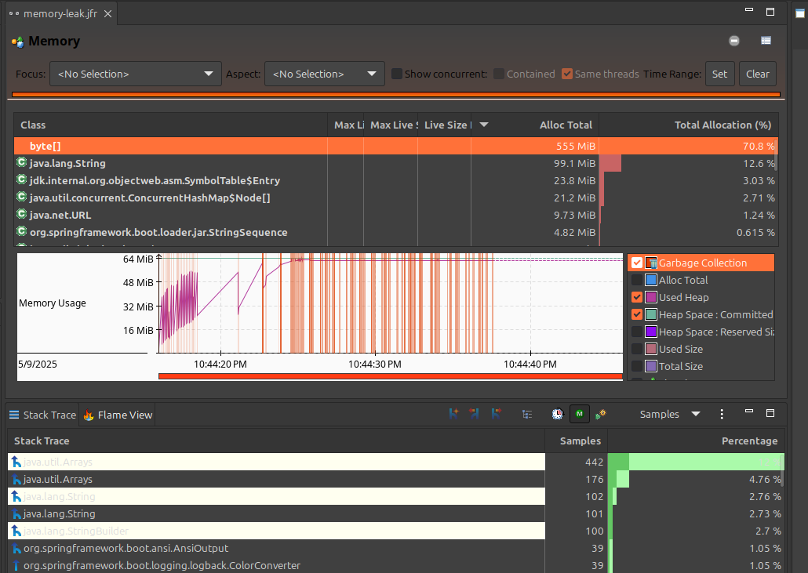
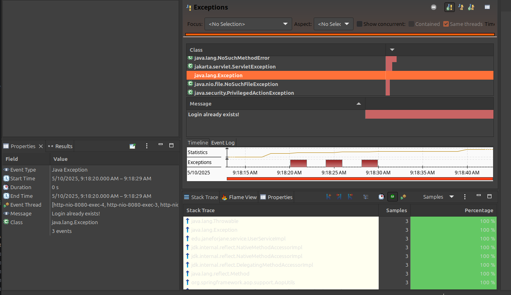
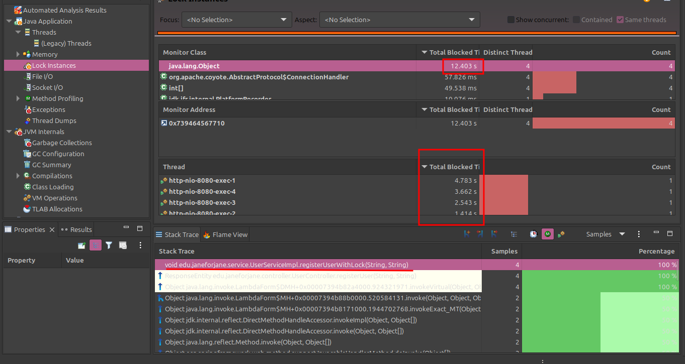

# Общее описание приложения
Это демонстрационное приложение на Spring Boot, которое имитирует различные проблемы 
для демонстрации процесса профилирования и анализа проблем в приложении.

## Architecture
### Основные классы и их взаимодействие
User:
Класс, представляющий пользователя. Содержит поля id, login, password и largeData. Поле largeData не сохраняется в базе данных и используется для усиления утечки памяти.

UserRepository:
Интерфейс, расширяющий JpaRepository, для взаимодействия с базой данных H2.

UserService:
Сервис, содержащий бизнес-логику для регистрации пользователей. Сохраняет все зарегистрированные объекты User в кэш (что вызывает утечку памяти), а также в БД.

UserController:
Контроллер, обрабатывающий HTTP-запросы. Взаимодействует с UserService для регистрации пользователей.

Приложение использует встроенную базу данных H2 для хранения данных пользователей.

### Взаимодействие классов
UserController принимает HTTP-запросы на регистрацию пользователей и передает данные в UserService.
UserService проверяет наличие логина в кэше и базе данных, создает новый объект User с большими данными и сохраняет его в кэш и базу данных.
UserRepository используется для взаимодействия с базой данных H2.

## Имитация проблем и анализ

### Утечка памяти

#### Code

**UserService**:

UserService хранит всех пользователей в cache

```java
public class UserServiceImpl {
    
    private UserRepository userRepository;
    private List<User> cachedUsers = new ArrayList<>();

    public void registerUser() {
        input_user.setLargeData(generateLargeData());
        cachedUsers.add(input_user);//memory leak reason
        userRepository.save(input_user);
    }

    private byte[] generateLargeData() {

        byte[] largeData = new byte[1024 * 1024];
        new Random().nextBytes(largeData);
        return largeData;
    }
}
```

#### Настройки запуска

```text
-Xmx64m
-Xms64m
-XX:+FlightRecorder
-XX:StartFlightRecording=settings=profile,filename=memory-leak.jfr,duration=30s
```


#### Анализ JFR:

    doc/memory-leak.jfr



    Memory 
    → частые GC — признак утечки
    → Постепенный рост потребления памяти (даже после GC)
    → byte[] - занимают всю память и не удаляются


### Лишние исключения

#### Code

**UserService**:

В UserService, перед сохранением нового
пользователя выполняется проверка на уникальность логина.

Если логин не уникален - выбрасывается исключение с сообщением:

        Login already exists!


```java
public class UserServiceImpl {
    
    public void registerUser() {
        
        // ... something done
        
        if (cachedUser.isPresent()) {
            log.warn("User with this login already exists in cache.");
            throw new Exception("Login already exists!"); // Исключение для JFR
        }

        Optional<User> existingUser = userRepository.findByLogin(login);
        if (existingUser.isPresent()) {
            log.warn("User with this login already exists in database.");
            throw new Exception("Login already exists!"); // Исключение для JFR
        }
    }
}
```

#### Настройки запуска

```text
-XX:+FlightRecorder 
-XX:StartFlightRecording=settings=default,filename=exceptions.jfr,
dumponexit=true -jar target/jfr-profiling-1.0-SNAPSHOT.jar
```

#### Логи приложения

```text
    	2025-05-10T09:18:17.491+03:00  INFO 478227 --- [nio-8080-exec-1] e.janeforjane.controller.UserController  : Got request for registration
        Hibernate: select u1_0.id,u1_0.login,u1_0.password from users u1_0 where u1_0.login=?
        Hibernate: select next value for users_seq
        2025-05-10T09:18:17.586+03:00  INFO 478227 --- [nio-8080-exec-1] e.janeforjane.service.UserServiceImpl    : New user was saved: User{login='test-user', password='amcqvpgc'}
        Hibernate: insert into users (login,password,id) values (?,?,?)
        2025-05-10T09:18:20.801+03:00  INFO 478227 --- [nio-8080-exec-2] e.janeforjane.controller.UserController  : Got request for registration
        Hibernate: select u1_0.id,u1_0.login,u1_0.password from users u1_0 where u1_0.login=?
        2025-05-10T09:18:20.804+03:00  WARN 478227 --- [nio-8080-exec-2] e.janeforjane.service.UserServiceImpl    : User with this login already exists in database.
        2025-05-10T09:18:20.806+03:00 ERROR 478227 --- [nio-8080-exec-2] o.a.c.c.C.[.[.[/].[dispatcherServlet]    : Servlet.service() for servlet [dispatcherServlet] in context with path [] threw exception [Request processing failed: java.lang.Exception: Login already exists!] with root cause

        java.lang.Exception: Login already exists!
        	at edu.janeforjane.service.UserServiceImpl.registerUser(UserServiceImpl.java:39) ~[classes/:na]
        	at java.base/jdk.internal.reflect.NativeMethodAccessorImpl.invoke0(Native Method) ~[na:na]
        	at java.base/jdk.internal.reflect.NativeMethodAccessorImpl.invoke(NativeMethodAccessorImpl.java:77) ~[na:na]
        	at java.base/jdk.internal.reflect.DelegatingMethodAccessorImpl.invoke(DelegatingMethodAccessorImpl.java:43) ~[na:na]
        	at java.base/java.lang.reflect.Method.invoke(Method.java:569) ~[na:na]
        	at org.springframework.aop.support.AopUtils.invokeJoinpointUsingReflection(AopUtils.java:343) ~[spring-aop-6.0.9.jar:6.0.9]
        	at org.springframework.aop.framework.ReflectiveMethodInvocation.invokeJoinpoint(ReflectiveMethodInvocation.java:196) ~[spring-aop-6.0.9.jar:6.0.9]
        	at org.springframework.aop.framework.ReflectiveMethodInvocation.proceed(ReflectiveMethodInvocation.java:163) ~[spring-aop-6.0.9.jar:6.0.9]
```


#### Анализ JFR:

    doc/exceptions.jfr



    Exceptions 
    → количество исключений - равно количеству отправленных запросов -1 
    (все запросы, кроме первого закончились выбросом исключения)
    → messages содержат текст выбрасываемого Exception


### Ненужные блокировки (synchronized/Lock)

#### Code

**UserService**:

Метод с блокировкой в UserService, который вызвается 
при регистрации пользователя. Он использует synchronized для имитации 
проблемы.


```java
public class UserServiceImpl {

    // Метод с блокировкой
    public void registerUserWithLock(String login, String password) throws Exception {
        synchronized (globalLock) {
            try {
                registerUser(login, password);
                Thread.sleep(1000); // Задержка 1000 мс
            } catch (InterruptedException e) {
                Thread.currentThread().interrupt();
            }
        }
    }
}
```

#### Настройки запуска

```text
-XX:+FlightRecorder 
-XX:StartFlightRecording=settings=profile,filename=locks.jfr,
duration=30s
```

#### Анализ JFR

    doc/locks/locks.jfr



    Lock instances 
    → количество блокировок - равно количеству отправленных запросов
    → блокировки длительные
    → в StackTrace - источники блокировки в методе сервиса registerUserWithLock